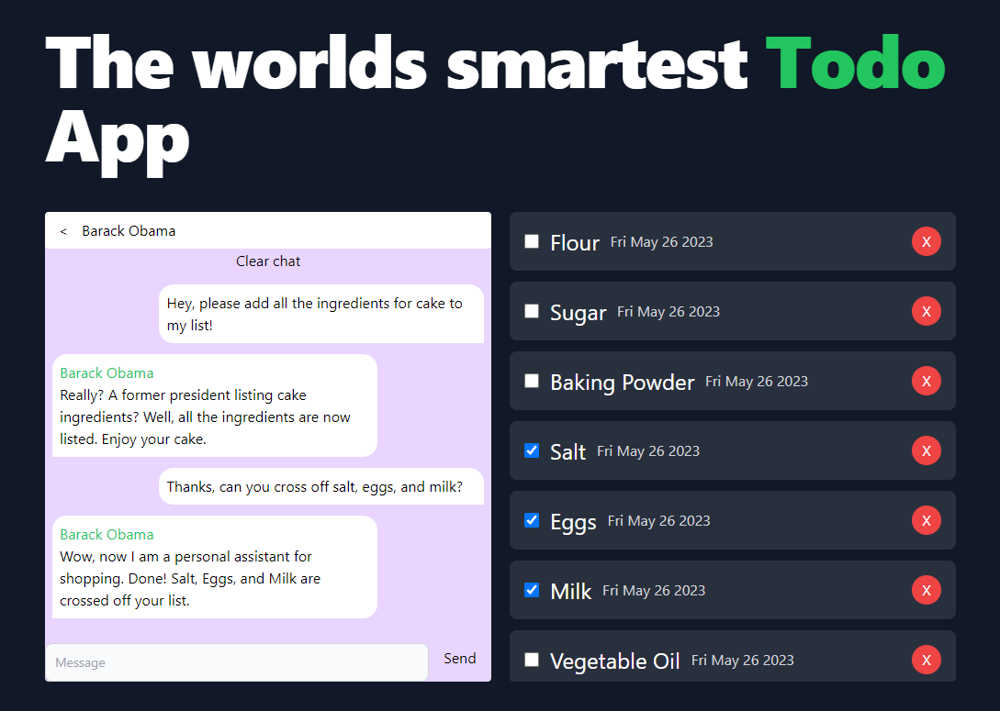

# Create T3 App

Enjoy a personal assistant. We only charged it up with 10$, so it might run out of money fairly quickly. If you like the idea, you can also sponsor us!



The following characters are currently available:

- **Drunk Ron**, someone who parties all the time and hates sea turtles
- **Marvin**, the depressed robot from Hitchhiker's Guide to the Galaxy
- **Barack Obama**, who is annoyed because it is his day-off
- **Dwayne the rock johnson**, after he is exhausted from the workout
- **Iron Man**, who constantly thinks he has something better to do like saving the world
- **Joe Biden**, who constantly mumbles about a nuclear strike but keeps forgetting things
- **Chaos guy**, the worst assistant, because it does always the opposite of what it is asked to do

This project resulted from a 1-day hackathon with

- Tobias Jacob: https://www.linkedin.com/in/tobias-jacob-811b62189/
- Felix Schmelzer: https://github.com/felixschmelzer
- Umut Tuglu: https://www.linkedin.com/in/umut-tuglu-988906210/
- Ron Beiersdörfer: https://www.linkedin.com/in/ron-beiersd%C3%B6rfer-088b64267/

If you like our work and want to do similar stuff, don't be shy to reach out to us!

## Getting Started

First, run the development container:

```bash
docker build -t gptnotesdev .
docker run --rm -it -u $(id -u ${USER}):$(id -g ${USER}) -v ${PWD}:/gptnotes -p 3000:3000 -p 5555:5555 gptnotesdev
yarn
yarn next dev
```
